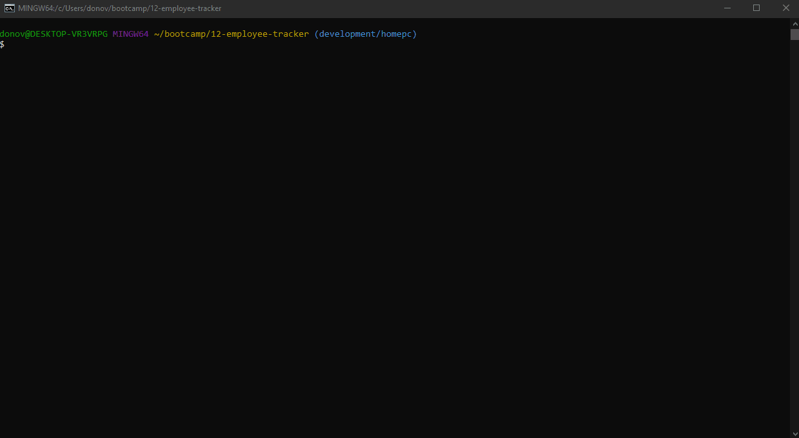
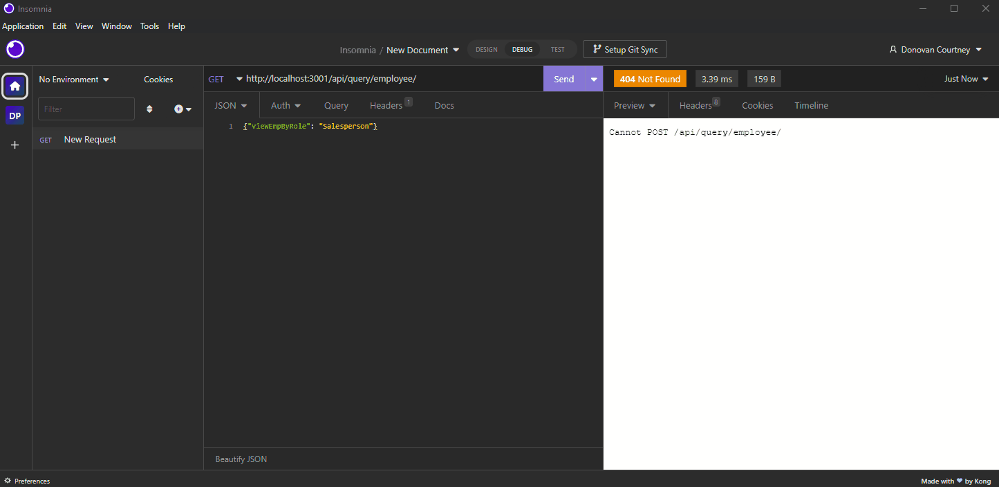

# Workforce Tracker

  
## Table of Contents

* [Description](#description)
* [Installation](#installation)
* [Usage](#usage)
* [Contribution](#contribution)
* [Testing](#testing)
* [Questions](#questions)
* [Licensing](#licensing)

## Description

Workforce Tracker allows you to keep track of Departments, Roles, and the Employees that populate those departments. The Tracker supports viewing each table with some filters applied and modifying the database by creating, updating and deleting records from each table.

The primary goal of this project was to use Inquirer to prompt a user for input and manipulate the SQL DB based on selections. Upon selection to view specific data the columns and rows will be displayed using Console-table-printer for a more readable format on command-line. All SQL queries are constructed in a JS module and passed to either the terminal or via Insomnia via HTML request methods.

Deployed Project: Not Currently Deployed

 
  
  
        
  

 

## Installation

To run Workforce Tracker locally you'll need to first install Node and then install the following modules:

- chalk: 4.1.2
- console-table-printer: 2.11.1
- express: 4.18.2
- inquirer: 8.2.4
- mysql2: 3.0.1
- typescript: 4.9.4
- nodemon (recommended)

If the JS files are not included you'll need to run: **tsc**
This will generate JS files from the Typescript files.

## Usage

Navigate to the project's root folder, open a terminal, and log into mysql: **mysql -u root -p**
Then create the database using the db/schema.sql: **source db/schema.sql**
From another terminal run the command: **node server.js**
Once the server starts you'll be asked if you want to rebuild the database. Selecting rebuild will read in **db/schema.sql**, DROP, and CREATE the database. Then you'll be asked if you want to seed the database which will read in **db/seeds.sql** and populate the DB. After the DB is initialized and connected the main menu will load and you can navigate through the menus manipulating the database.

In addition to the command-line interface, routes have been created and is front-end ready.
For now a basic index.html is displayed at root and a generic 404 page catch-all.
Refer to the query file for specific routes to manipulate the database.

 
  
  
        
  

 
 
This is an example of using Insomnia to access routes.

 
  
  
        
  

 

## Contribution

Follow the "fork-and-pull" Git workflow.

  1. **Fork** the repo on GitHub
  2. **Clone** the project to your own machine
  3. **Commit** changes to your own branch
  4. **Push** your work back up to your fork
  5. Submit a **Pull request** so that we can review your changes

NOTE: Be sure to merge the latest from "upstream" before making a pull request!

## Testing
  
N/A

## Questions

Feel free to contact me with any questions or comments:  
<donovan.courtney@gmail.com>  
<https://github.com/decourtney>

## Licensing

Code and Docs released under [MIT License](https://choosealicense.com/licenses/mit/).
